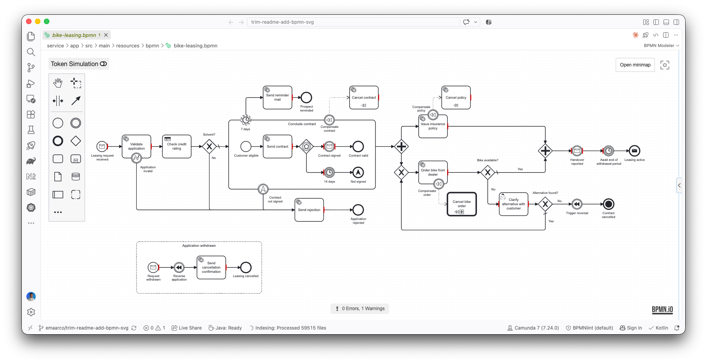
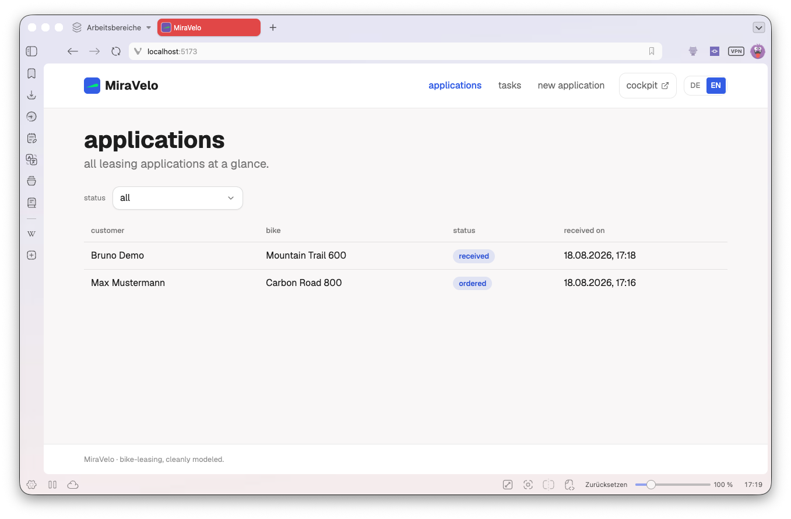

# Fullstack Bike-Leasing Blueprint

> [!NOTE]
> **🚧 Work in progress.** This is a **solution template**, a reference to fork and build on, for
> our consultants and anyone else, not a product that ships. It's still being fleshed out, so parts
> may be incomplete and it may not yet fully demonstrate what it's meant to. Treat it as a
> living example, and expect it to keep evolving.

**One opinionated way to start a greenfield process-automation project, wired end to end.** One BPMN
process, automated with a [CIB seven](https://cibseven.org) (community Camunda 7 fork) **embedded
engine**, a **React frontend**, and an **AI-agent setup**. Its **architecture is kept honest by
tests**, so it can't quietly rot as the process grows.



## Why fork this

Most automation examples stop at a `.bpmn` file and a few delegates. Real projects need a UI, a
contract between front and back, tests that mean something, and an architecture that survives the
tenth feature. Fork this and you inherit all of it, **guardrailed**:

- 🧊 **Hexagonal backend**, enforced by ArchUnit + Konsist, so violations fail the build.
- 🧩 **Feature-Sliced frontend**, enforced by steiger + ESLint + knip.
- 🔗 **A committed, drift-gated OpenAPI contract**: the backend generates it, orval turns it into the
  frontend's typed client.
- 🧪 **A real quality net**: mutation testing (gated at 80), Bruno API scenarios, Playwright journeys.
- 🤖 **AI-ready**: `AGENTS.md`, eight skills, and two review subagents, so agent- and hand-written
  code get the same instant "you broke a rule" feedback.

## The scenario

**MiraVelo** is a (fictional) lifestyle bike brand that leases gravel and road bikes to private and
corporate customers. The process automates a leasing application from first request to active lease:
credit check, contract signing, insurance, and bike order, plus timers, a DMN decision, compensation,
and a back-office inbox for the awkward cases.

In the UI a customer submits an application, watches the case advance on its own (the detail page
polls while the engine works), and signs the contract when asked. When a bike is out of stock the
case lands in the back-office inbox (`/aufgaben`), where an agent picks an alternative and the process
continues.



## What's inside

- **Backend:** Kotlin / Spring Boot, hexagonal, CIB seven embedded (JavaDelegates). The full BPMN
  palette: message start, DMN, event-based gateway, timers, parallel fork/join, user tasks,
  compensation.
- **Frontend:** React, Feature-Sliced Design, Tailwind, TanStack Router/Query, forms with
  react-hook-form + zod, MSW-backed vitest, Playwright e2e mapped 1:1 to the Bruno scenarios.
- **The contract:** springdoc generates `openapi/openapi.json` (committed, drift-gated); orval
  regenerates the frontend's typed TanStack Query client from it.

## Getting started

```bash
# 1. start Postgres
docker compose -f stack/docker-compose.yml up -d

# 2. run the backend + engine (CIB seven Cockpit at http://localhost:8080/camunda, admin/admin)
./gradlew :service:app:bootRun

# 3. run the UI (http://localhost:5173)
npm --prefix frontend ci && npm --prefix frontend run dev
```

Then open <http://localhost:5173>, submit an application with the out-of-stock bike, sign the
contract, open `/aufgaben`, resolve the clarification, and watch the status advance on its own.

Prefer containers? `./gradlew :service:app:bootBuildImage` then
`docker compose -f stack/docker-compose.full.yml up --build` brings up frontend + app + Postgres on
<http://localhost:8090>.

Verify the whole thing:

```bash
./gradlew build                        # arch + unit + process + model validation + spec export
git diff --exit-code openapi/openapi.json
./gradlew :service:app:pitest          # mutation score >= 80
npm --prefix frontend run verify       # format, eslint, steiger, knip, tsc, vitest
```

The full dev loop (Bruno, Playwright, contract regeneration) is in [CONTRIBUTING.md](CONTRIBUTING.md).

## Why it's shaped this way

Every non-obvious decision (the embedded engine, hexagonal, FSD, the OpenAPI contract, the mutation
gate, tracking the latest majors) is recorded as an **Architecture Decision Record**. Read the *why*
before changing the *what*: start at the [docs index](docs/README.md) and its [ADRs](docs/adr/).

## Repository structure

```
fullstack-example/
├── AGENTS.md · CLAUDE.md            # AI guidance (AGENTS.md is the single source)
├── service/
│   ├── common-architecture-tests/  # ArchUnit + Konsist rules (fail the build)
│   └── app/                         # hexagonal Kotlin/Spring Boot + CIB seven
├── openapi/openapi.json            # GENERATED by a test, COMMITTED, drift-gated in CI
├── frontend/                        # React + FSD (npm-only; e2e/ Playwright specs)
├── bruno/                           # API scenario collections
├── tools/                           # bpmnlint + git-hook installer
├── stack/                           # docker-compose.yml (dev DB) · docker-compose.full.yml (full stack)
├── docs/{README.md, adr/, assets/}  # ADRs + diagrams
├── .claude/{skills/, agents/}       # 8 skills, 2 subagents
└── .github/workflows/               # pre-merge (parallel jobs) + nightly
```

## Contributing & License

Contributions welcome. See [CONTRIBUTING.md](CONTRIBUTING.md) and use
[Conventional Commits](https://www.conventionalcommits.org). Licensed under MIT (see [LICENSE](LICENSE)).
